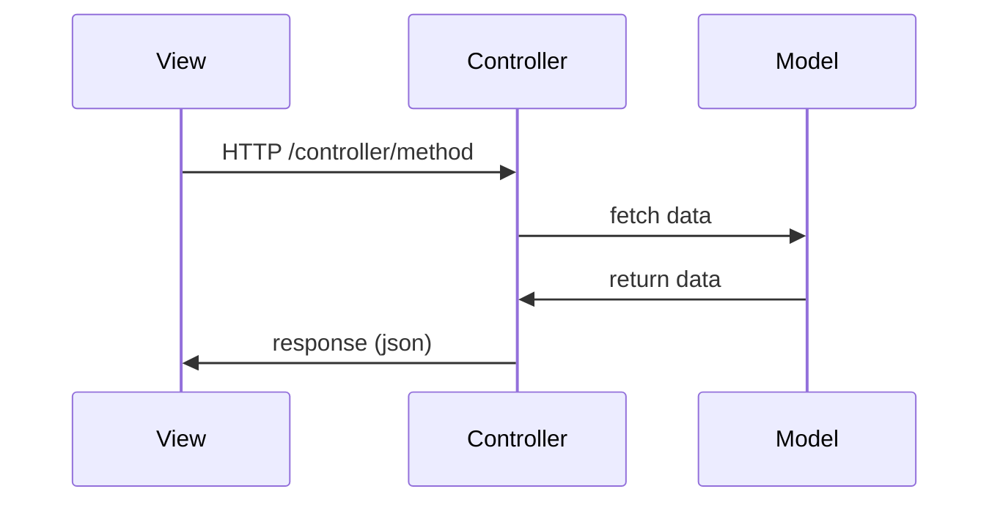

# mvc

```mermaid
sequenceDiagram
    participant V as View
    participant C as Controller
    participant M as Model
    V ->> C: HTTP /controller/method
    C ->> M: fetch data
    M ->> C: return data
    C ->> V: response (json)
```
